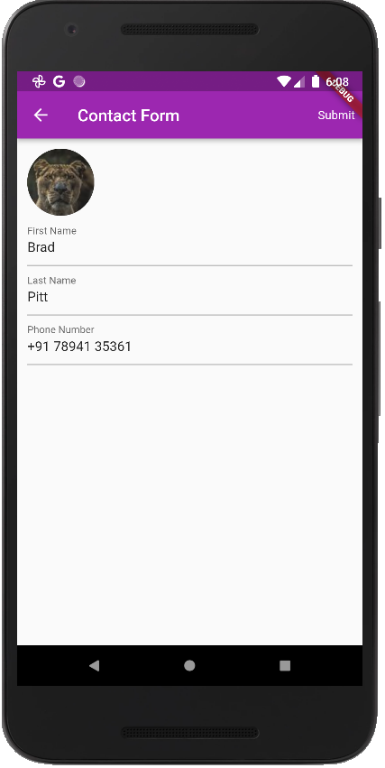

# contacts_app
     


[Provider](https://pub.dev/packages/provider) paketi, state yönetimi için kullanılan InheritedWIdget çevresinde bir wrapper'dır(sarmalayıcıdır).

Provider ile, widget ağacına bir state object (durum nesnesi) yerleştirebilir ve onu diğer herhangi bir alt widget öğesinden erişilebilir hale getirebiliriz.
Provider ayrıca, verilerle başlatarak ve widget ağacından kaldırıldıklarında onlardan sonra temizleyerek state nesnelerinin yaşam süresinin yönetilmesine yardımcı olur.
Provider, BLoC bileşenlerini uygulamak için bile kullanılabilir veya diğer state yönetimi çözümlerinin temeli olarak hizmet edebilir!
Veya basitçe, verileri widget'lara geçirmek için süslü bir terim olan [dependency injection](https://en.wikipedia.org/wiki/Dependency_injection) için kullanılabilir.

## Plugin (eklenti) ekleme

Flutter projemize [provider](https://pub.dev/packages/provider) eklentisini ekleyerek başlayalım.

pubspec.yaml dosyanıza gidin ve cupertino_icons eklentisini (plugin) arayın. Bunun altına, uygulamanız için ihtiyaç duyacağınız eklentileri ekleyebilirsiniz. Provider paketini de buraya ekleyelim.

```
cupertino_icons: ^1.0.4
provider: ^6.0.2

```


Bu yapıldıktan sonra pub get komutunu çalıştırın. Android Studio kullanıyorsanız, sağ üst köşede Pub get seçeneğini göreceksiniz. VS Code'u kullanırsanız, dosyayı kaydederseniz komut otomatik olarak çalışır.


## ChangeNotifier ekleme
Provider paketini projemize eklediğimize göre şimdi kullanalım. Verileri tüketmeye başlamadan önce bir ChangeNotifier uygulamamız gerekiyor. Bu, kişi listemize bir şey eklendiğinde, güncellendiğinde veya kaldırıldığında verileri tüketen tüm widget'lara bildirir.


lib içinde provider adında yeni bir klasör oluşturuyoruz ve bunun içinde contact-provider.dart adında bir dosya oluşturuyoruz.


```
import '../model/contact.dart';
import 'package:flutter/material.dart';

class ContactProvider extends ChangeNotifier {
  List<Contact> _contactList = [];
  
  List<Contact> get contacts {
    return [..._contactList];
  }
  
  set contacts(List<Contact> newContacts) {
    _contactList = newContacts;
    notifyListeners();
  }
  
  void addContact(Contact newContact) {
    _contactList.add(newContact);
    notifyListeners();
  }
  
  void removeContact(int index) {
    _contactList.removeAt(index);
    notifyListeners();
  }

```


Başlangıç ​​olarak, ContactProvider sınıfımızı oluşturuyoruz ve ChangeNotifier'ı extend etmesini sağlıyoruz. Bu, uygulamamızdaki verileri güncellemek için kullanacağımız notifyListeners() yöntemine erişmemizi sağlar.

Bir getter ve setter kullanılarak erişilebilen özel bir kişi listemiz _contactList var. Bunun dışında da addContact() ve removeContact() yöntemlerimiz var. Bu yöntemlerin her birinde, bir kişi eklendiğinde veya kaldırıldığında widget'ları güncelleyen notifyListeners() yöntemini kullandığımızı göreceksiniz.


Bu yapıldıktan sonra, main.dart dosyamıza gidiyoruz ve MaterialApp'imizi bir MultiProvider() widget'ına sarıyoruz. MultiProvider'da , uygulama içinde kullanmak istediğimiz tüm provider'ların bir listesini beyan ederiz.

main.dart dosyamız şöyle görünmelidir:


```
import 'package:contacts_app/provider/contact-provider.dart';
import 'package:flutter/material.dart';
import 'package:provider/provider.dart';
import 'contacts-page.dart';

void main() {
  runApp(MyApp());
}

class MyApp extends StatelessWidget {
  @override
  Widget build(BuildContext context) {
    return MultiProvider(
      providers: [
        ChangeNotifierProvider.value(value: ContactProvider()),
      ],
      child: MaterialApp(
        title: 'Flutter Demo',
        theme: ThemeData(
          primarySwatch: Colors.purple,
          visualDensity: VisualDensity.adaptivePlatformDensity,
        ),
        home: ContactsPage(),
      ),
    );
  }
}
```

## Provider'ı kullanmak

Artık change listener kurulumumuzu yaptığımıza göre, contact-page.dart dosyasına geri dönelim. Kişiler listesini aldığımızda provider'ı güncelleyebilmemiz için _getContacts() yöntemini değiştiririz .


```
  void _getContacts() async {
    await Future.delayed(Duration(milliseconds: 200));
    ContactProvider contactProvider =
        Provider.of<ContactProvider>(context, listen: false);
    contactProvider.contacts = dummyData;
  }
```


Provider'ımızı başlatıyoruz ve providerdaki kişilerimizi güncelliyoruz. Provider'ınızı başlatırken listen parametresini false olarak ayarlamayı unutmayın. Provider'ı yalnızca verilerinize erişmek için kullanırsınız, değişiklikleri dinlemek için değil.

Artık verileri elde ettiğimize göre, geriye kalan bir sonraki şey, bu verileri ListView'de tüketmek. Bunu _buildListView() yönteminde yapıyoruz.


```
 Widget _buildListView(context) {
    return Consumer<ContactProvider>(
      builder: (context, snapshot, child) {
        return ListView.builder(
          itemBuilder: (context, index) => ContactCard(
            index: index,
            contact: snapshot.contacts[index],
            updateCallback: _updateContact,
            deleteCallback: () => snapshot.removeContact(index),
          ),
          itemCount: snapshot.contacts.length,
        );
      },
    );
  }
```


ListView'imizi , türünün ContactProvider olduğu bir `Consumer<T>()` widget'ına sarıyoruz. Tüketici oluşturucu işlevi bize bir context, model ve alt değişkenler verir. Model bize ListView'imizi doldurmak için kullandığımız kişileri sağlar. Aşağıdaki kişi listemiz için kullanıcı arayüzünü görebilirsiniz.


Bu yazıda Provider ve Consumer'ın nasıl kullanılacağına ve ChangeNotifiers konularına göz attık ve provider'ı, contact uygulamamızı oluşturmak için kullandık.

Kodun tamamına ulaşmak için: https://github.com/gulsenkeskin/contacts_app

[reference](https://blog.devgenius.io/working-with-providers-part-1-8edb5aa0e169)

